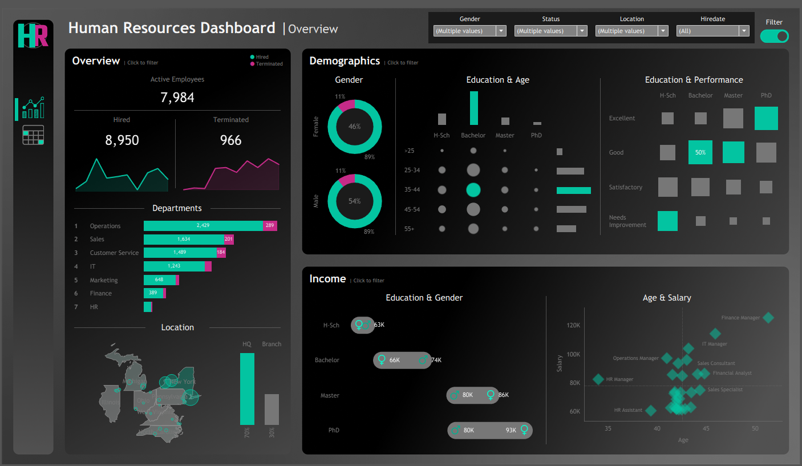
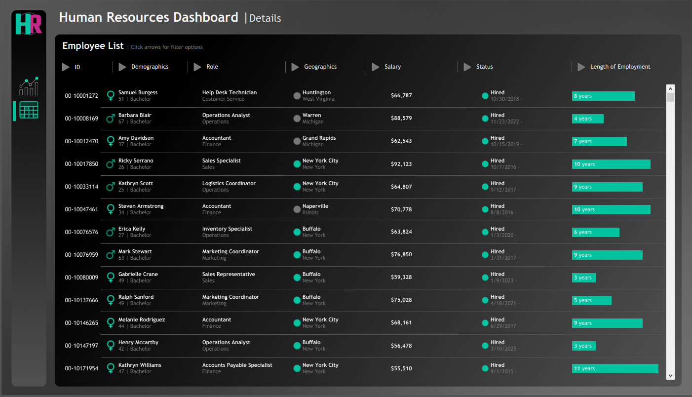

[README.md](https://github.com/user-attachments/files/31758005/README.md)
<div align="center">

# 👔 HR Analytics Dashboard

### A Two-Page Tableau Workbook for Workforce Demographics, Attrition & Compensation


</div>

---

## 📑 Table of Contents

- [Overview](#-overview)
- [Dashboard Preview](#️-dashboard-preview)
- [Dataset](#️-dataset)
- [Dashboards](#-dashboards)
- [Calculated Fields & Analytical Logic](#-calculated-fields--analytical-logic)
- [Key Insights](#-key-insights)
- [Tools & Techniques](#️-tools--techniques)
- [Project Structure](#-project-structure)
- [How to Use](#-how-to-use)
- [Contact Me](#-contact-me)

---

## 📌 Overview

**HR Analytics Dashboard** is a Tableau workbook (`.twbx`) that turns a company-wide employee roster into a two-page HR intelligence tool: a **Summary** page for headcount, demographics, and attrition trends, and a **Details** page for exploring every individual employee record behind a full filter panel.

The workbook is powered by **124 calculated fields** — employment status, tenure, age bucketing, HQ vs. Branch classification, top-N ranking, and automatic peak highlighting — turning a flat employee list into a genuinely interactive analytics tool.

---

## 🖼️ Dashboard Preview

<div align="center">

### 📈 Overview Page
Headcount, hiring vs. termination trend, demographics, and income breakdown.



<br/><br/>

### 🔍 Details Page
Full, filterable employee list with expandable Demographics, Role, Geographics, Salary, Status, and Length of Employment columns.



</div>

**Headcount by department (Active / Terminated / Total):**

| Department | Active | Terminated | Total |
|---|---|---|---|
| Operations | 2,429 | 289 | 2,718 |
| Sales | 1,634 | 201 | 1,835 |
| Customer Service | 1,489 | 184 | 1,673 |
| IT | 1,243 | 139 | 1,382 |
| Marketing | 648 | 70 | 718 |
| Finance | 389 | 63 | 452 |
| HR | 152 | 20 | 172 |

**Other verified highlights from the Overview page:**
- Gender split: **54% Male / 46% Female**, each with a matching ~89% Hired / ~11% Terminated ratio
- Location split: **70% HQ (New York) / 30% Branch offices**
- The Age & Salary scatter plot shows Finance Managers and IT Managers at the top of the pay scale (~$110K–$135K), while Sales Specialists and HR Assistants cluster at the lower end

---

## 🗃️ Dataset

`dataset.csv` — **8,950 employee records**, one row per employee, with the following fields: Employee ID, First/Last Name, Gender, State, City, Education Level, Birthdate, Hiredate, Termdate, Department, Job Title, Salary, and Performance Rating.

**Verified scope of the data:**
- 👥 **8,950** employees — **7,984 Active** and **966 Terminated** (a **10.8%** attrition rate)
- 📅 Hire dates span **2015-01-01 to 2024-12-29**
- 💵 Salary range: **$51,835 – $149,377**, averaging **$70,964**
- 🏢 **7** departments (HR, Finance, Marketing, Operations, IT, Sales, Customer Service) across **28** distinct job titles
- 🌎 **8** U.S. states (New York, Pennsylvania, Ohio, Illinois, Michigan, Virginia, North Carolina, West Virginia)
- 🎓 **4** education levels (High School, Bachelor, Master, PhD) and **4** performance ratings (Excellent, Good, Satisfactory, Needs Improvement)

---

## 📊 Dashboards

### 📈 Overview (internal name: `HR | Summary`)
| KPI Cards (BANs) | Supporting Visuals |
|---|---|
| **BAN Hired**, **BAN Active**, **BAN Terminated** | `Departments`, `Job Titles`, `Gender`, `Education Levels`, `Gender vs Education Level`, `Age`, `Age Groups`, `Age vs Education`, `Age vs Salary`, `Education vs Performance`, `Hired By Year`, `Terminated By Year`, `Location` / `Map States`, `Cities`, `States` |

A single page that answers "how healthy is the workforce right now?" — headcount, hiring and attrition trends by year, salary distribution by age and education, and a geographic breakdown of where employees are based.

### 🔍 Details (internal name: `HR | Details`)
A record-level explorer built around one central `Detailed` grid, paired with a comprehensive filter panel:
- **Demographic Filters** — gender, education level, age
- **Geographic Filters** — state, city
- **Role Filters** — department, job title
- **Salary Filters** — compensation range
- **Status Filters** — active vs. terminated
- **Length Filters** — tenure range
- **Employee ID Filter** — direct lookup by ID

This page lets an HR analyst drill from the high-level Summary straight down to individual employees matching any combination of criteria.

---

## 🧮 Calculated Fields & Analytical Logic

A sample of the logic behind the 124 calculated fields:

```
Employment Status = IF ISNULL([Termdate]) THEN 'Hired' ELSE 'Terminated' END

HQ / Branch = CASE [State] WHEN 'New York' THEN 'HQ' ELSE 'Branch' END

Age = DATEDIFF('year', [Birthdate], TODAY())

Tenure (years) = IF ISNULL([Termdate])
                 THEN DATEDIFF('year', [Hiredate], TODAY())
                 ELSE DATEDIFF('year', [Hiredate], [Termdate])
                 END

Full Name = [First Name] + ' ' + [Last Name]
```

- **Employment Status** drives the Active/Terminated split used throughout the Summary page and as a filter on the Details page.
- **HQ / Branch** flags New York (headquarters) separately from every other state (branch offices) for location-based comparisons.
- **Tenure** is calculated correctly for *both* active employees (up to today) and terminated employees (up to their term date) — so average tenure isn't skewed by people still employed.
- **Top-N ranking** (`RANK(...) <= 1` / `<= 2`) highlights the top department(s) or state(s) on demand.
- **`WINDOW_MAX(...) = [value]`** automatically flags the single highest bar on charts like Hired/Terminated By Year, without manual annotation.
- **`[value] / TOTAL([value])`** powers percent-of-total breakdowns (e.g., gender or education share of headcount).

---

## 💡 Key Insights

- Attrition sits at **10.8%** (966 of 8,950 employees terminated) — the `Terminated By Year` chart shows exactly which years drove that number.
- Tenure is tracked fairly for everyone, since terminated employees are measured up to their actual last day rather than today's date — avoiding an inflated average tenure.
- The HQ/Branch split isolates New York from the other 7 states, useful for comparing headquarters staffing and pay against branch offices.
- With 28 job titles across 7 departments and a $51,835–$149,377 salary range, the `Age vs Salary` and `Education vs Performance` charts surface where compensation and performance actually align — or don't.

---

## 🛠️ Tools & Techniques

- **Tableau Desktop** — dashboard design, filter actions, and packaged workbook (`.twbx`) publishing
- **Calculated Fields (124 total)** — status, tenure, age bucketing, HQ/Branch classification, full-name concatenation
- **Table Calculations** — `RANK()` for top-N highlighting, `WINDOW_MAX()` for automatic peak detection, `TOTAL()` for percent-of-whole
- **Filter Actions** — a seven-category filter panel (demographic, geographic, role, salary, status, tenure, employee ID) on the Details page
- **Geographic Mapping** — a built-in state-level map (`Map States`) for headcount by location

---

## 📁 Project Structure

```
HR-Analytics-Dashboard/
├── README.md
├── HR_Dashboard.twbx
├── dataset.csv
└── assets/
    ├── dashboard-overview.png
    └── dashboard-details.png
```

---

## 🚀 How to Use

1. Download `HR_Dashboard.twbx` from this repository — it's a packaged workbook, so the data is already embedded inside it.
2. Open it in **Tableau Desktop** or **Tableau Reader** (free viewer, no license required).
3. Start on the **HR | Summary** page for the big picture, then use the navigation icon to jump to **HR | Details**.
4. On the Details page, combine any of the seven filter panels to drill down to a specific employee segment — or look up a single employee directly by ID.
5. `dataset.csv` is included separately for reference or if you want to rebuild the data connection from scratch.

---

## 📬 Contact Me

<div align="center">

[](mailto:salemomar676@gmail.com)
[](https://gamma.app/docs/Copy-of-Brand-Partnership-Proposal-lrp9yrhau9gdpj1)
[](https://www.linkedin.com/in/eng-omarsalem)

</div>

---

<div align="center">

Made with 👔 and Tableau

</div>
