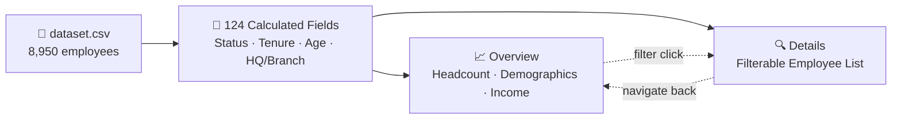

[README.md](https://github.com/user-attachments/files/32444232/README.md)
<div align="center">

# 👔 HR Analytics Dashboard

### Turning an 8,950-Row Employee Roster into a Two-Page Decision-Making Tool


</div>

<br/>

> *"How healthy is the workforce right now — and why?"* That's the single question this workbook is built to answer, from a full-company snapshot down to one employee's record.

---

## 📑 Table of Contents

- [Overview](#-overview)
- [Dashboard Preview](#️-dashboard-preview)
- [Dataset](#️-dataset)
- [How It's Wired Together](#-how-its-wired-together)
- [Dashboards, Page by Page](#-dashboards-page-by-page)
- [The Calculation Engine](#-the-calculation-engine)
- [Key Insights](#-key-insights)
- [Business Questions Answered](#-business-questions-answered)
- [Skills Demonstrated](#-skills-demonstrated)
- [Tools & Techniques](#️-tools--techniques)
- [Possible Extensions](#-possible-extensions)
- [Project Structure](#-project-structure)
- [How to Use](#-how-to-use)
- [Contact Me](#-contact-me)

---

## 📌 Overview

**HR Analytics Dashboard** is a Tableau workbook (`.twbx`) built on a company-wide employee roster. It's deliberately split into two pages that mirror how an actual HR team works: **Overview** for the executive-level pulse check, and **Details** for the analyst who needs to drill into one employee, one team, or one filter combination at a time.

Nothing here is a static export. Every number on the Overview page — headcount, attrition, income, education — is generated live from **124 calculated fields**, so the whole story updates the instant a Gender, Status, Location, or Hiredate filter is touched.

---

## 🖼️ Dashboard Preview

<div align="center">

### 📈 Overview
*The pulse check: who we have, who we're losing, and what they earn.*


<br/><br/>

### 🔍 Details
*The drill-down: every employee, one searchable, sortable record at a time.*


</div>

<br/>

<div align="center">

| Active | Terminated | Male / Female | HQ / Branch |
|:---:|:---:|:---:|:---:|
| **7,984** | **966** | **54% / 46%** | **70% / 30%** |

</div>

<details>
<summary><b>📋 Full department breakdown (Active / Terminated / Total) — click to expand</b></summary>
<br/>

| Department | Active | Terminated | Total |
|---|---|---|---|
| Operations | 2,429 | 289 | 2,718 |
| Sales | 1,634 | 201 | 1,835 |
| Customer Service | 1,489 | 184 | 1,673 |
| IT | 1,243 | 139 | 1,382 |
| Marketing | 648 | 70 | 718 |
| Finance | 389 | 63 | 452 |
| HR | 152 | 20 | 172 |

The Age & Salary scatter tells its own story: **Finance Managers and IT Managers** sit at the top of the pay scale (~$110K–$135K), while **Sales Specialists and HR Assistants** cluster at the lower end — a compensation ladder visible in one glance.

</details>

---

## 🗃️ Dataset

`dataset.csv` — **8,950 employee records**, one row per employee: Employee ID, First/Last Name, Gender, State, City, Education Level, Birthdate, Hiredate, Termdate, Department, Job Title, Salary, and Performance Rating.

| | |
|---|---|
| 📅 **Hire dates** | 2015-01-01 → 2024-12-29 |
| 💵 **Salary range** | $51,835 – $149,377 (avg. **$70,964**) |
| 🏢 **Departments** | 7, across **28** distinct job titles |
| 🌎 **States** | 8 (New York, Pennsylvania, Ohio, Illinois, Michigan, Virginia, North Carolina, West Virginia) |
| 🎓 **Education** | High School · Bachelor · Master · PhD |
| ⭐ **Performance** | Excellent · Good · Satisfactory · Needs Improvement |

---

## 🔗 How It's Wired Together



Both pages read from the same 124 calculated fields, so a filter set on one page and a chart built on the other are always telling the same story from two different altitudes.

---

## 📊 Dashboards, Page by Page

### 📈 Overview *(internal name: `HR | Summary`)*

| Zone | What lives there |
|---|---|
| **Headcount** | `BAN Hired`, `BAN Active`, `BAN Terminated` — with a Hired-vs-Terminated trend sparkline |
| **Departments** | Ranked bar list, Active headcount with Terminated overlay |
| **Location** | `Map States` + HQ vs. Branch split bar |
| **Demographics** | `Gender`, `Education & Age`, `Education & Performance` matrix |
| **Income** | `Education & Gender` pay comparison, `Age & Salary` scatter by job title |

### 🔍 Details *(internal name: `HR | Details`)*

One central `Detailed` employee grid, sliced by a seven-category filter panel:

`Demographic` · `Geographic` · `Role` · `Salary` · `Status` · `Length of Employment` · `Employee ID`

Every column — Demographics, Role, Geographics, Salary, Status, Length of Employment — expands into its own set of filter options, so an analyst can go from "show me everyone" to "Bachelor's-degree Operations Analysts in Michigan hired after 2019" in four clicks.

---

## 🧮 The Calculation Engine

<details open>
<summary><b>Core logic behind the 124 calculated fields</b></summary>

```javascript
// Status — the backbone of every Active/Terminated split on the workbook
Employment Status = IF ISNULL([Termdate]) THEN 'Hired' ELSE 'Terminated' END

// Geography — isolates headquarters from every branch office
HQ / Branch = CASE [State] WHEN 'New York' THEN 'HQ' ELSE 'Branch' END

// Demographics
Age = DATEDIFF('year', [Birthdate], TODAY())

// Fairness fix: terminated employees are measured to their LAST day, not today
Tenure (years) = IF ISNULL([Termdate])
                 THEN DATEDIFF('year', [Hiredate], TODAY())
                 ELSE DATEDIFF('year', [Hiredate], [Termdate])
                 END

Full Name = [First Name] + ' ' + [Last Name]
```

| Technique | Where it's used |
|---|---|
| `RANK(...) <= N` | Highlights the top department(s) or state(s) on demand |
| `WINDOW_MAX(...) = [value]` | Auto-flags the single highest bar on `Hired/Terminated By Year` — no manual annotation |
| `[value] / TOTAL([value])` | Powers every percent-of-total ring (gender split, education share) |

</details>

---

## 💡 Key Insights

> 🔹 **10.8% attrition** (966 of 8,950) — and because Tenure is measured to each employee's *actual* last day rather than today, that number isn't quietly inflated by people still on the payroll.
>
> 🔹 **70/30 HQ-to-Branch split** — New York alone carries the majority of headcount, making it the natural lens for any location-based comparison.
>
> 🔹 **Pay tracks role, not just tenure** — the `Age vs Salary` scatter shows Finance and IT Managers clearly separated from Sales Specialists and HR Assistants, regardless of age.
>
> 🔹 **Education ≠ automatic performance** — the `Education & Performance` matrix lets you check that assumption directly instead of taking it on faith.

---

## ❓ Business Questions Answered

- What's our current headcount, and how has hiring vs. attrition trended year over year?
- Which departments and states carry the most risk of turnover?
- Is compensation aligned with role and performance, or with age and tenure alone?
- Where is the company overexposed to a single location (HQ vs. Branch)?
- Given any combination of filters — department, state, education, salary band — who exactly are the employees behind that number?

---

## 🧠 Skills Demonstrated

- **Data modeling** — shaping a flat CSV into a fully calculated, filter-ready data source
- **Tableau calculated fields** — conditional logic (`IF`/`CASE`), date math (`DATEDIFF`), string concatenation
- **Table calculations** — `RANK()`, `WINDOW_MAX()`, `TOTAL()` for dynamic, self-updating highlights
- **Dashboard UX design** — a two-tier information hierarchy (Overview → Details) with consistent navigation
- **Filter actions** — a seven-category, cross-filtering panel built for real analyst workflows
- **Geographic visualization** — state-level mapping of headcount and HQ/Branch concentration

---

## 🛠️ Tools & Techniques

- **Tableau Desktop** — dashboard design, filter actions, packaged workbook (`.twbx`) publishing
- **Calculated Fields (124 total)** — status, tenure, age bucketing, HQ/Branch classification, full-name concatenation
- **Table Calculations** — `RANK()`, `WINDOW_MAX()`, `TOTAL()`
- **Filter Actions** — a seven-category panel (demographic, geographic, role, salary, status, tenure, employee ID)
- **Geographic Mapping** — a built-in state-level map for headcount by location

---

## 🔮 Possible Extensions

- Add a rolling 12-month **attrition-rate trend line** (vs. the current year-by-year bar) to catch early warning signs faster
- Layer in **manager/reporting-line data** to analyze span of control and team-level attrition
- Add a **compensation-benchmarking view** against external market data by job title
- Publish to **Tableau Server/Cloud** with row-level security so each department head only sees their own team

---

## 📁 Project Structure

```
HR-Analytics-Dashboard/
├── README.md
├── HR_Dashboard.twbx
├── dataset.csv
└── assets/
    ├── dashboard-overview.png
    └── dashboard-details.png
```

---

## 🚀 How to Use

1. Download `HR_Dashboard.twbx` — it's a packaged workbook, so the data is already embedded inside.
2. Open it in **Tableau Desktop** or the free **Tableau Reader**.
3. Start on **Overview** for the big picture, then use the sidebar icon to jump to **Details**.
4. On Details, combine any of the seven filter panels to drill down to a specific employee segment — or look one up directly by ID.
5. `dataset.csv` is included separately in case you want to rebuild the data connection from scratch.

---

## 📬 Contact Me

<div align="center">

[](mailto:salemomar676@gmail.com)
[](https://gamma.app/docs/Copy-of-Brand-Partnership-Proposal-lrp9yrhau9gdpj1)
[](https://www.linkedin.com/in/eng-omarsalem)

</div>
